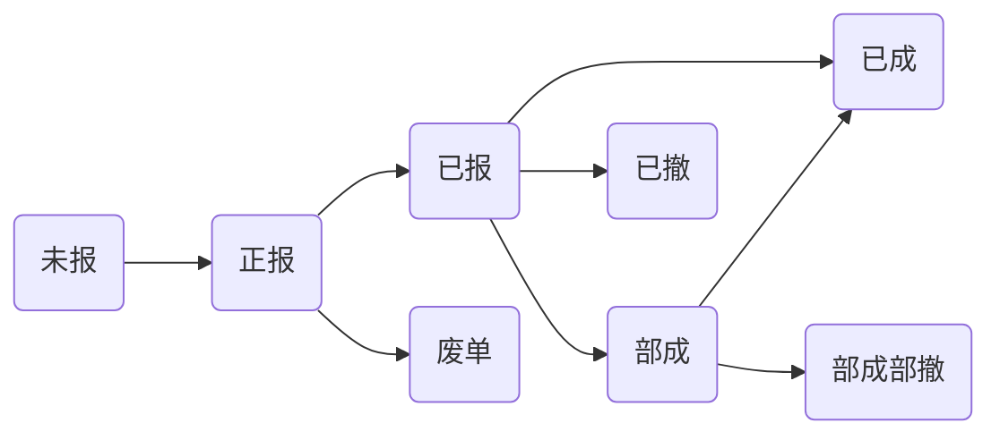

# OpenOrder_CTP
CTP接口的二次封装，实现委托状态和成交的严格排序与缓存，还可以省心支持对接CTP之外的其他证券交易柜台，如LTS、QMT、UFT、TradeX等。

## OpenOrder(CTP)版：是CTP，更省心更全面的API

**注意**: 目前并未支持所有的CTP API接口，仅支持Order Insert/Cancel委托指令。OpenOrder在内部进行委托查询，所以尚未开放提供委托、成交查询接口。

**注意**: 目前委托命令中，暂不支持`UserForceClose`、`IsAutoSuspend`、``ForceCloseReason`等属性。

**注意**: 为了在内部维护委托和成交、撤单的关联关系，`OrderRef`字段被用于存放`ORRequestID`，自行填入的值会被OpenOrder内部冲销。各个API函数参数`nRequestID`也被内部冲销。

**注意**：试用版本，每日撤单的`nRequestID`编号值不能超过 10。

**注意**：试用版本，仅提供Win64的Debug版本。

使用OpenOrder(CTP)替换原生CTP接口的使用方式：
- C++中include使用OpenOrder(CTP)提供的API头文件。
- 链接“OpenOrderd.lib”和“ctp_wrapperd.lib”。在运行时需要使用“OpenOrderd.dll”。
- 增加了`namespace OpenOrder`。
- 取消CreateFtdcTraderApi函数的入参，Init()增加参数，为pCounterConfig，请传入配置信息。
- 撤单时，仅需要在ReqOrderAction参数中。（暂不支持`THOST_FTDC_AF_Modify`）
- 其余基本无需改变（不支持的API接口请暂时隐去代码，或联系我进行添加）

内部延迟：**30us** （试用版 **300us**）。

主要特点：
- 使用CTP原生API接口，可以对接CTP柜台，也可以对接到其余的期货和证券交易接口，目前支持TradeX、LTS、QMT等。
- OpenOrder在内部实现了委托状态管理，自动完成当日委托、成交的有序管理和缓存。
- 用户在使用OpenOrder之后，委托和成交回报严格按照如下顺序发生：
    - `正报` - `已报` - `已成`
    - `正报` - `已报` - `已撤`
    - `正报` - `已报` - `部成` - `部成部撤 `
    - `正报` - `废单（本地/柜台）`
    - `正报` - `已报` - `废单（交易所）`
- 成交回报总是在委托状态推送前。
- 可以确认委托的唯一编号：`ORRequestID`，无需自行处理`OrderRef`、`SessionID`、`FrontID`等信息。如果是补单，则为负数。
    - 所有`ORRequestID`的编号值的`绝对值`是单调递增的（不一定连续）。
- 撤单失败通过`onErrRtnOrderCancel`返回。

### 状态机
状态机定义如下图所示（`废单`、`已撤`、`部成部撤`、`已成`等四种为最终状态）：

